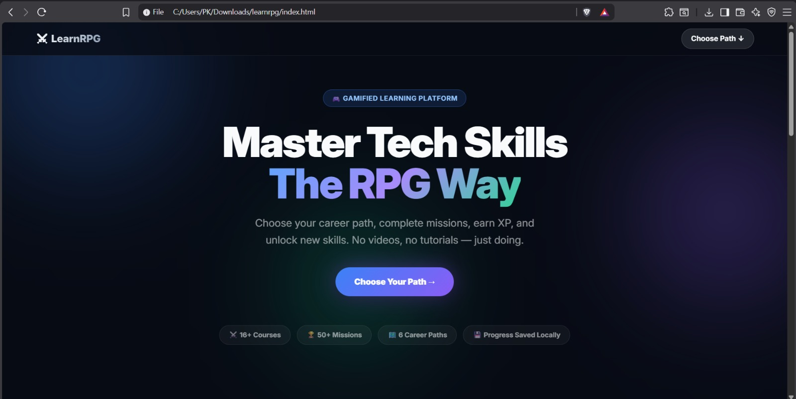
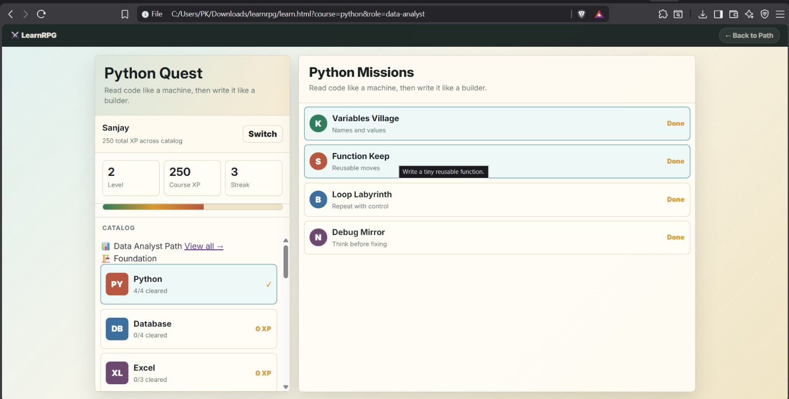
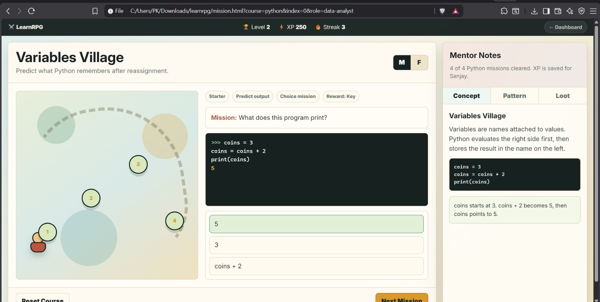
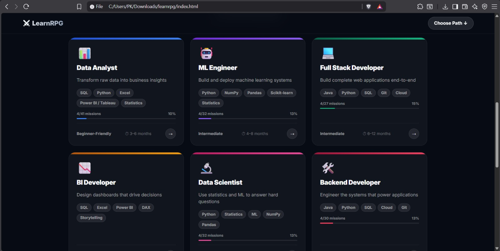

# LearnRPG

LearnRPG is a browser-based gamified learning platform for career preparation. It turns job skills into RPG-style missions where learners choose a career path, complete practical challenges, earn XP, unlock mentor notes, and track progress locally.

The current product is focused on data analytics preparation, while also including role paths for machine learning, full-stack, backend, frontend, and cloud/devops.

## Live Demo

Open `index.html` directly in your browser, or deploy the folder with GitHub Pages.

## Why This Exists

Most learning sites make people read first and practice later. LearnRPG flips that:

- Try a mission first.
- Predict, code, or reason.
- Unlock the explanation after attempting.
- Earn XP and build a visible progress trail.

## Features

- Career path landing page
- Data Analyst roadmap with job-ready skills
- Course catalog with missions
- RPG quest map and mission workspace
- XP, levels, streaks, and loot
- Multiple mission types:
  - Choice missions
  - Code-writing missions
  - Blank reasoning missions
- Mentor notes and solution explanations
- Local profile login with browser storage
- No backend required
- Static deployment ready

## Data Analyst Job Roadmap

The Data Analyst path includes:

- Python
- Database fundamentals
- Advanced SQL
- Excel
- Pandas
- NumPy
- Statistics
- Visualization
- BI Dashboards
- Business Metrics
- Data Cleaning
- Cloud and Warehouses
- Storytelling
- Capstone Projects
- Portfolio and Interviews
- Interview Drills

## Tech Stack

- HTML
- CSS
- Vanilla JavaScript
- `localStorage` for progress persistence

No framework, build step, server, or database is required.

## Project Structure

```text
learnrpg/
  index.html
  learn.html
  mission.html
  role.html
  css/
    reset.css
    tokens.css
    layout.css
    components.css
    home.css
    role.css
    learn-nav.css
    responsive.css
  js/
    data/
      courses.js
      roles.js
    events.js
    home.js
    main.js
    render.js
    role.js
    state.js
    storage.js
  docs/
    CATALOG.md
    DEPLOYMENT.md
    PRODUCT.md
    ROADMAP.md
  .gitignore
  .nojekyll
  CONTRIBUTING.md
  LICENSE
  package.json
  README.md
```

## Getting Started

### Option 1: Open directly

Open `index.html` in a modern browser.

### Option 2: Serve locally

```bash
npm run dev
```

Then open the local URL shown in your terminal.

You can also use any static server:

```bash
python -m http.server 8080
```

## GitHub Pages Deployment

1. Create a new GitHub repository.
2. Upload the contents of this `learnrpg` folder.
3. Commit to the `main` branch.
4. Go to repository `Settings`.
5. Open `Pages`.
6. Set source to `Deploy from a branch`.
7. Choose branch `main` and folder `/root`.
8. Save.

GitHub Pages will publish the project as a static site.

## How Progress Is Stored

Progress is stored in the visitor's browser using `localStorage`.

Saved data includes:

- Player name
- Active role/course
- Course XP
- Streak
- Completed missions
- Written attempts

There is no server account system in this version.

## Adding Courses

All course data lives in:

```text
js/data/courses.js
```

Add a new key to the `COURSES` object using the existing schema.
# LearnRPG

🎮 A gamified learning platform where users master tech skills through RPG-style progression.

## 🌐 Live Demo

👉 **https://sanjay34598.github.io/learnrpg/**

---

## Screenshots

### Home Page



### Learning Dashboard



### Missions



## Home page

A gamified learning platform where users master technical skills through RPG-style progression.




## Learning Dashboards 


## Missions


## Adding Career Paths

All career path data lives in:

```text
js/data/roles.js
```

Each role references course IDs from `courses.js`.

## Status

This is a static MVP that is ready to publish as a GitHub project. It is intentionally lightweight so it can be opened, studied, modified, and deployed easily.

## License

MIT
